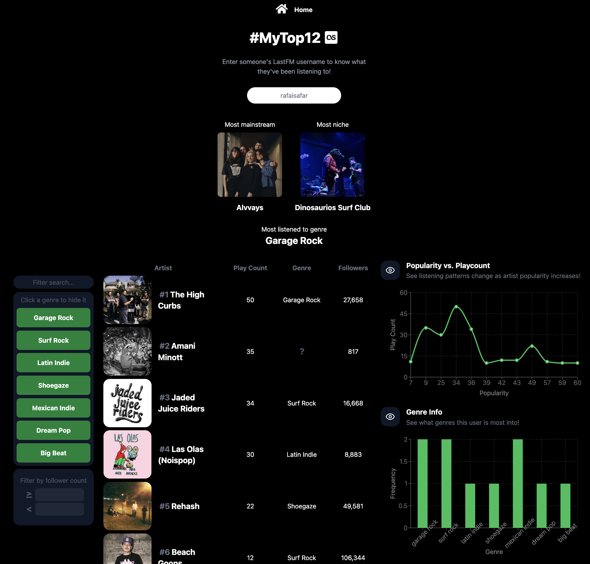

# Web Development Project 6 - *#MyTop12 Part 2*

Submitted by: **Rafael Niebles**

This web app: **Allows anyone to find out more info about any LastFM user's top 12 most listened to tracks.**

Time spent: **4** hours spent in total

## Required Features

The following **required** functionality is completed:

- [x] **Clicking on an item in the list view displays more details about it**
  - Clicking on an item in the dashboard list navigates to a detail view for that item
  - Detail view includes extra information about the item not included in the dashboard view
    > Popularity score and full list of artist genres are displayed
  - The same sidebar is displayed in detail view as in dashboard view
    > Since there's only the detail view and dashboard, and you can only navigate between those 2, the only necessary sidebar button was "Home".
  - *To ensure an accurate grade, your sidebar **must** be viewable when showing the details view in your recording.*
- [x] **Each detail view of an item has a direct, unique URL link to that item’s detail view page**
  -  *To ensure an accurate grade, the URL/address bar of your web browser **must** be viewable in your recording.*
    > The user must click on the table row to navigate to the detail view
- [x] **The app includes at least two unique charts developed using the fetched data that tell an interesting story**
  - At least two charts should be incorporated into the dashboard view of the site
  - Each chart should describe a different aspect of the dataset
    > 2 charts; one shows listening frequency change as artist popularity increases (showing how "niche" or "mainstream" someone's taste is) and the other shows the genres which a given user listens to most and how much 

The following **optional** features are implemented:

- [x] The site’s customized dashboard contains more content that explains what is interesting about the data 
  - e.g., an additional description, graph annotation, suggestion for which filters to use, or an additional page that explains more about the data
    > The 2 charts have brief descriptions outlining what they show
- [x] The site allows users to toggle between different data visualizations
  - User should be able to use some mechanism to toggle between displaying and hiding visualizations 
    > The 2 charts have buttons controlling whether they're shown/hidden 

[Click here for a video walkthrough.](https://drive.google.com/file/d/1kmggR-woo-n9KwhlGa4gr_dWa12iQAac/view?usp=sharing)

A video was used due to the length required to show all features!

Image preview:

 

## Notes

It was fairly straightfoward to extend part 1 and implement everything. Due to API limitations, the only additional info I could include in detail view was popularity score and the full list of genres the artist pertains to.

## License

    Copyright [2025] [Rafael Niebles]

    Licensed under the Apache License, Version 2.0 (the "License");
    you may not use this file except in compliance with the License.
    You may obtain a copy of the License at

        http://www.apache.org/licenses/LICENSE-2.0

    Unless required by applicable law or agreed to in writing, software
    distributed under the License is distributed on an "AS IS" BASIS,
    WITHOUT WARRANTIES OR CONDITIONS OF ANY KIND, either express or implied.
    See the License for the specific language governing permissions and
    limitations under the License.

